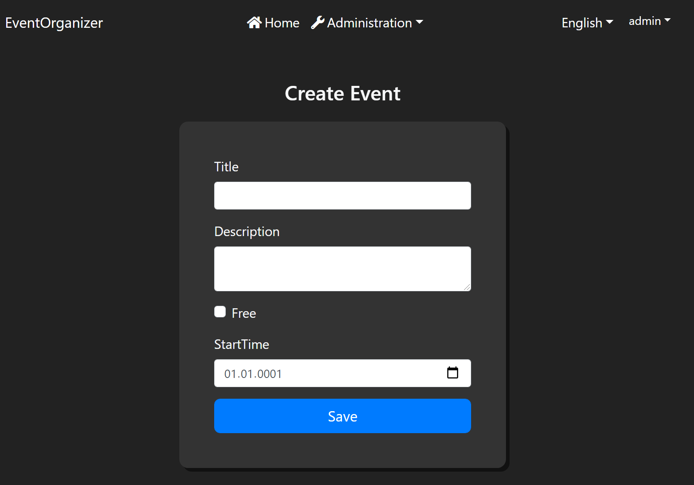

# Event Organizer Workshop Notes

This document is a reference on giving the ABP & Blazor Workshop. It contains the steps to build the application.

## The Final Application

TODO: Add final images at the beginning

## Requirements

The following tools are needed to be able to run the solution.

* .NET 5.0 SDK
* Visual Studio 2019 16.8.0+ or another compatible IDE
* MongoDB Server (with MongoDB Compass)

## Development

### Clean the Database

* If it does exists, delete the MongoDB `EventOrganizer` database for a fresh start.

### Creating a new Application

* Use the following ABP CLI command:

````bash
abp new EventOrganizer -u blazor -d mongodb --preview
````

### Open & Run the Application

* Open the solution in Visual Studio (or your favorite IDE).
* Run the `EventOrganizer.DbMigrator` application to seed the initial data.
* Run the `EventOrganizer.HttpApi.Host` application that starts the server side.
* Run the `EventOrganizer.Blazor` application to start the UI.

### Apply the Custom Styles

* Add styles to `wwwroot/main.css`:

````css
body.abp-application-layout {
    background-color: #222 !important;
    font-size: 18px;
}
nav#main-navbar.bg-dark {
    background-color: #222 !important;
    box-shadow: none !important;
}
.event-pic {
    width: 100%;
    border-radius: 12px;
    box-shadow: 5px 5px 0px 0px rgba(0,0,0,.5);
    margin-bottom: 10px;
}
.event-link:hover, .event-link:hover *{
    text-decoration: none;
}
.event-link:hover .event-pic {
    box-shadow: 5px 5px 0px 0px #ffd800;
}
.event-form {
    background-color: #333 !important;
    box-shadow: 5px 5px 0px 0px rgba(0,0,0,.5);
    border-radius: 12px;
}
.table {
    background: #fff;
    border-radius: 12px;
    box-shadow: 5px 5px 0px 0px rgba(0,0,0,.5);
}
.table th{
    border: 0 !important;
}
.modal {
    color: #333;
}
.page-item:first-child .page-link {
    margin-left: 0;
    border-top-left-radius: 12px;
    border-bottom-left-radius: 12px;
}
.page-item:last-child .page-link {
    border-top-right-radius: 12px;
    border-bottom-right-radius: 12px;
}
.btn {
    border-radius: 8px;
}
.att-list {
    list-style: none;
    padding: 0;
}
.att-list li {
    padding: 4px 0 0 0;
}
````

* `wwwroot/index.html`: Remove `bg-light` class from the `body` tag and add `bg-dark text-light`.
* **TODO: Add logo**

### Domain Layer

* Add the following `Event` aggregate (with `EventAttendee`) to the solution:

**Event**

````csharp
using System;
using System.Collections.Generic;
using Volo.Abp.Domain.Entities.Auditing;

namespace EventOrganizer.Events
{
    public class Event : FullAuditedAggregateRoot<Guid>
    {
        public string Title { get; set; }

        public string Description { get; set; }

        public bool IsFree { get; set; }

        public DateTime StartTime { get; set; }

        public ICollection<EventAttendee> Attendees { get; set; }

        public Event()
        {
            Attendees = new List<EventAttendee>();
        }
    }
}
````

**EventAttendee**

```csharp
using System;
using Volo.Abp.Auditing;

namespace EventOrganizer.Events
{
    public class EventAttendee : IHasCreationTime
    {
        public Guid UserId { get; set; }

        public DateTime CreationTime { get; set; }
    }
}
```

### MongoDB Mapping

* Add the following property to the `EventOrganizerMongoDbContext`:

````csharp
public IMongoCollection<Event> Events => Collection<Event>();
````

### Clean Index.razor & Add the Header & "Create Event" button

* Clean the `Index.razor` file.
* Paste the following code:

````html
@page "/"
@inherits EventOrganizerComponentBase
<Row Class="mb-4">
    <Column Class="text-left">
        <h1>Upcoming Events</h1>
    </Column>
    <Column Class="text-right">
        @if (CurrentUser.IsAuthenticated)
        {
            <a class="btn btn-primary" href="/create-event">
                <i class="fa fa-sign-in-alt"></i> @L["CreateEvent"]
            </a>
        }
    </Column>
</Row>
````

The Result:


### Implement Event Creation

* Create the Initial `IEventAppService` with the `CreateAsync` method:

````csharp
using System;
using System.Threading.Tasks;
using Volo.Abp.Application.Services;

namespace EventOrganizer.Events
{
    public interface IEventAppService : IApplicationService
    {
        Task<Guid> CreateAsync(EventCreationDto input);
    }
}
````

* Add `EventCreationDto` class:

````csharp
using System;
using System.ComponentModel.DataAnnotations;

namespace EventOrganizer.Events
{
    public class EventCreationDto
    {
        [Required]
        [StringLength(100)]
        public string Title { get; set; }

        [Required]
        [StringLength(2000)]
        public string Description { get; set; }

        public bool IsFree { get; set; }

        public DateTime StartTime { get; set; }
    }
}
````

* Implement the `EventAppService`:

````csharp
using System;
using System.Threading.Tasks;
using Microsoft.AspNetCore.Authorization;
using Volo.Abp.Domain.Repositories;

namespace EventOrganizer.Events
{
    public class EventAppService : EventOrganizerAppService, IEventAppService
    {
        private readonly IRepository<Event, Guid> _eventRepository;

        public EventAppService(IRepository<Event, Guid> eventRepository)
        {
            _eventRepository = eventRepository;
        }

        [Authorize]
        public async Task<Guid> CreateAsync(EventCreationDto input)
        {
            var eventEntity = ObjectMapper.Map<EventCreationDto, Event>(input);
            await _eventRepository.InsertAsync(eventEntity);
            return eventEntity.Id;
        }
    }
}
````

* Add AutoMapper mapping to the `EventOrganizerApplicationAutoMapperProfile` class:

````csharp
using AutoMapper;
using EventOrganizer.Events;

namespace EventOrganizer
{
    public class EventOrganizerApplicationAutoMapperProfile : Profile
    {
        public EventOrganizerApplicationAutoMapperProfile()
        {
            CreateMap<EventCreationDto, Event>();
        }
    }
}
````

This will automatically create the HTTP (REST) API for the application service (run the `EventOrganizer.HttpApi.Host` application to see it on the Swagger UI):


* Create the `CreateEvent.razor` file:

````csharp
@page "/create-event"
@inherits EventOrganizerComponentBase
<Heading Size="HeadingSize.Is3" Margin="Margin.Is5.FromTop.Is4.FromBottom" Class="text-center">Create Event</Heading>
<Row>
    <Column ColumnSize="ColumnSize.Is6.Is3.WithOffset">
        <div class="p-lg-5 p-md-3 event-form">
            <EditForm Model="@Event" OnValidSubmit="Create">
                <Field>
                    <FieldLabel>@L["Title"]</FieldLabel>
                    <TextEdit @bind-Text="@Event.Title" />
                </Field>
                <Field>
                    <FieldLabel>@L["Description"]</FieldLabel>
                    <MemoEdit @bind-Text="@Event.Description" />
                </Field>
                <Field>
                    <Check TValue="bool" @bind-Checked="@Event.IsFree">@L["Free"]</Check>
                </Field>
                <Field>
                    <FieldLabel>@L["StartTime"]</FieldLabel>
                    <DateEdit TValue="DateTime" @bind-Date="@Event.StartTime" />
                </Field>
                <Button Type="@ButtonType.Submit" Block="true" Color="@Color.Primary" Size="Size.Large">@L["Save"]</Button>
            </EditForm>
        </div>
    </Column>
</Row>
````

* Create a partial `CreateEvent` class in the same folder, with the `CreateEvent.razor.cs` as the file name:

````csharp
using System.Threading.Tasks;
using EventOrganizer.Events;
using Microsoft.AspNetCore.Components;

namespace EventOrganizer.Blazor.Pages
{
    public partial class CreateEvent
    {
        private EventCreationDto Event { get; set; } = new EventCreationDto();

        private readonly IEventAppService _eventAppService;
        private readonly NavigationManager _navigationManager;

        public CreateEvent(
            IEventAppService eventAppService,
            NavigationManager navigationManager)
        {
            _eventAppService = eventAppService;
            _navigationManager = navigationManager;
        }

        private async Task Create()
        {
            var eventId = await _eventAppService.CreateAsync(Event);
            _navigationManager.NavigateTo("/events/" + eventId);
        }
    }
}
````

The final UI is (run the `EventOrganizer.Blazor` application and click to the "Create Event" button):



